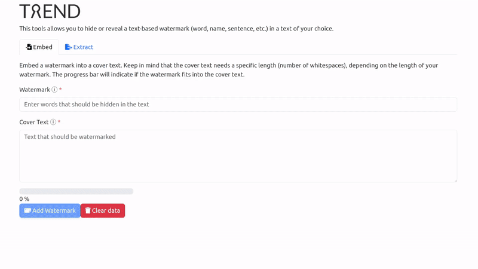

<!--
 Copyright (c) 2024 Fraunhofer-Gesellschaft zur Förderung der angewandten Forschung e.V.

 This work is licensed under the Fraunhofer License (on the basis of the MIT license)
 that can be found in the LICENSE file.
-->

# Webinterface

The following example shows how the webinterface includes the watermark "Fraunhofer ISST"
inside a _Lorem ipsum_ dummy cover text. Afterward, the watermarked text is copied into a public
contact form and then copied back into the webinterface. As can be seen, the webinterface is able
to extract the hidden watermark from the cover text:

